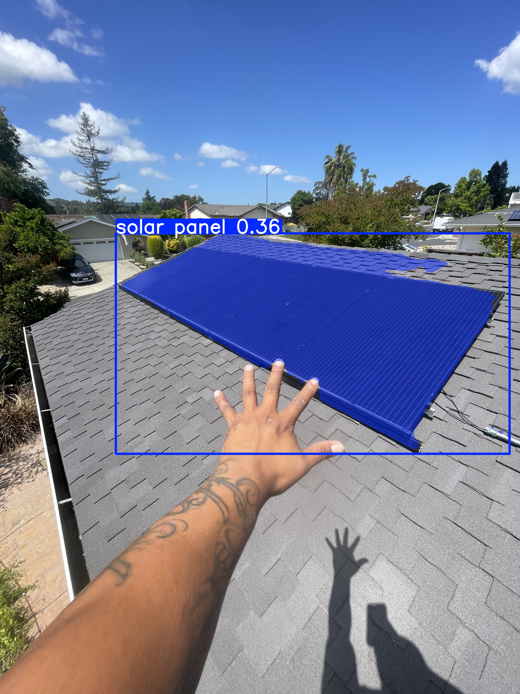
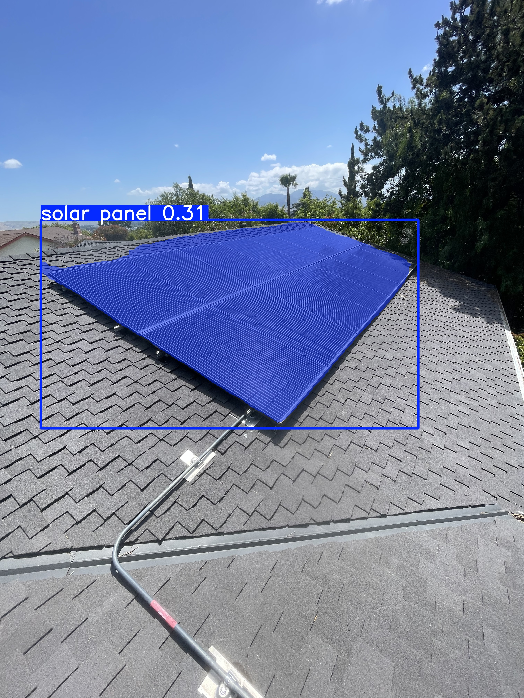

# VLM-Based Electrical Panel Inspection — Proof of Concept

> **Objective:** Given input images of domestic electrical panels, automatically extract electrical specifications using Vision-Language Models (VLMs).

---

## Table of Contents

1. [Overview](#overview)
2. [Experiments](#experiments)
   - [Experiment 1 — Solar System Inspection](#experiment-1--solar-system-inspection)
   - [Experiment 2 — Solar Panel Detection (YOLOE)](#experiment-2--solar-panel-detection-yoloe)
   - [Experiment 3 — Sub-Panel 1 Extraction](#experiment-3--sub-panel-1-extraction)
   - [Experiment 4 — Sub-Panel 2 Extraction](#experiment-4--sub-panel-2-extraction)
   - [Experiment 5 — HVAC Unit Inspection](#experiment-5--hvac-unit-inspection)
3. [General Approach](#general-approach)
4. [Challenges](#challenges)
5. [Future Improvements](#future-improvements)

---

## Overview

This POC explores can Vision-Language Models (VLMs) reliably extract structured electrical specifications from photographs of residential electrical panels. The target panels include:

- **Solar installation components** (inverter, solar modules)
- **Sub-Panel 1** — Exterior panel
- **Sub-Panel 2** — Interior panel
- **HVAC unit** — Exterior equipment
- **Main Panel** — Not viable for extraction due to image quality constraints

The primary model used for local inference is **Qwen3-VL-2B-Instruct**, hosted locally. For more complex or dense panels, API-based inference via **Groq** (`qwen/qwen3.8-27b`) is used as a fallback.

---

## Experiments

### Experiment 1 — Solar System Inspection

**Model:** `Qwen3-VL-2B-Instruct` (locally hosted)
**Task:** Extract solar service provider and inverter details from images of the existing solar installation.


#### Output JSON

```json
{
  "solar_module_make_model": "Jinko Solar",
  "inverter_location": "Exterior",
  "inverter_make_model": "SolarEdge SE5000H-US",
  "inverter_breaker_location": "Exterior"
}
```

#### Result

| Field                     | Extracted Value      | Ground Truth         | Remarks                   |
| ------------------------- | -------------------- | -------------------- | ------------------------- |
| Solar Module Make/Model   | Jinko Solar          | Jinko JKM290M-60B    | Model number not captured |
| Inverter Make/Model       | SolarEdge SE5000H-US | SolarEdge SE5000H-US | ✅ Exact match            |
| Inverter Location         | Exterior             | Exterior             | ✅ Match                  |
| Inverter Breaker Location | Exterior             | Exterior             | ✅ Match                  |
| Inverter Quantity         | —                   | 1                    | Not extracted             |

---

### Experiment 2 — Solar Panel Detection (YOLOE)

**Model:** `YOLOE-26l-seg` (open-vocabulary object detection with segmentation)
**Task:** Detect and localize solar panels within an image using a free-text prompt (`"solar panel"`), without relying on fixed COCO class labels.

#### Approach

Images were captured in HEIC format (iPhone). Since YOLOE requires standard raster input, the image was first converted from HEIC to JPEG before running inference.

YOLOE was configured with:

- **Confidence threshold:** 0.15 (low, to account for panels not resembling standard COCO objects)
- **IoU threshold:** 0.45
- **Output:** Annotated image saved with bounding box + segmentation mask overlays

#### What YOLOE Adds

Unlike traditional detection models bound to fixed object categories, YOLOE accepts arbitrary text prompts at runtime. This makes it particularly suitable for domain-specific objects like solar panels, which may not appear in standard training datasets.

**Assessment:** 🔬 Exploratory. Useful as a **Stage 1** localisation step in a multi-stage pipeline — detecting and cropping the panel region before passing it to a VLM for detailed specification extraction.

#### Output Images




---

### Experiment 3 — Sub-Panel 1 Extraction

**Model:** `Qwen3-VL-2B-Instruct` (locally hosted)
**Location:** Exterior

#### Output JSON

```json
{
  "component": "sub_panel",
  "location": "Exterior",
  "panel_type": "Bottom_fed",
  "bus_bar_rating_amps": "200",
  "main_breaker_rating_amps": "100",
  "feeder_breaker": {
    "source_panel": "MSP",
    "rating_amps": "Unknown"
  },
  "available_breaker_slots": 6,
  "make_model": "Eaton BR2040B200",
  "breakers_1_pole": {
    "count": 0,
    "breakers": []
  },
  "breakers_2_pole": {
    "count": 2,
    "breakers": [
      {
        "label": "Solar",
        "rating_amps": 30
      },
      {
        "label": "House Sub",
        "rating_amps": 100
      }
    ]
  },
  "condition_notes": "All breakers are in good condition. No visible damage or corrosion.",
  "confidence": "high"
}
```

#### Panel Specifications

| Field               | Extracted Value  | Ground Truth | Remarks                                       |
| ------------------- | ---------------- | ------------ | --------------------------------------------- |
| Make/Model          | Eaton BR2040B200 | Eaton        | Model detail is a bonus; brand correct ✅     |
| Panel Type          | Bottom-fed       | Top-fed      | ❌ Incorrect — misread cable entry direction |
| Bus Bar Rating      | 200 A            | 200 A        | ✅ Match                                      |
| Main Breaker Rating | 100 A            | NA           | ❌ Incorrectly reported a main breaker        |
| Feeder Source       | MSP              | MSP - 100 A  | ✅ Source correct; amperage not captured      |
| Available Slots     | 6                | 8            | ❌ Undercounted by 2 slots                    |
| Confidence          | High             | —           | Overconfident given errors                    |

#### Breakers Detected

| Label           | Poles  | Extracted Rating | Ground Truth Rating | Remarks                          |
| --------------- | ------ | ---------------- | ------------------- | -------------------------------- |
| Solar           | 2-pole | 30 A             | 30 A                | ✅ Match                         |
| House Sub       | 2-pole | 100 A            | 100 A               | ✅ Match                         |
| 1-pole breakers | —     | None             | None (NA)           | ✅ Correct — no 1-pole breakers |

---

### Experiment 4 — Sub-Panel 2 Extraction

**Location:** Interior
**Make/Model:** Bryant

This experiment involved a more challenging panel with dense, overlapping circuit labels and faded handwriting, requiring two separate inference attempts.

#### 4a — Local Inference (Qwen3-VL-2B-Instruct)

> [!WARNING]
> The local model **hallucinated** significantly on this panel. Due to overlapping breaker labels and dense wiring, the model repeated identical entries (e.g., multiple `KITCHEN / 20A` and `DRYER / 20A` breakers) and was unable to reliably distinguish individual circuits.

**Issues Observed:**

- Repeated labels for the same slot (17 breakers listed vs. realistic count)
- All 1-pole breakers incorrectly assigned 20 A — no differentiation

#### 4b — Cloud Inference via Groq API (qwen/qwen3.8-27b)

> [!NOTE]
> Switching to the larger cloud-hosted model (`qwen3.8-27b` via Groq API) produced **significantly more accurate and realistic results**.

#### Output JSON

```json
{
  "component": "sub_panel",
  "location": "Interior",
  "panel_type": "Top_fed",
  "bus_bar_rating_amps": 125,
  "main_breaker_rating_amps": "NA",
  "feeder_breaker": {
    "source_panel": "Unknown",
    "rating_amps": "Unknown"
  },
  "available_breaker_slots": 3,
  "make_model": "Bryant",
  "breakers_1_pole": {
    "count": 7,
    "breakers": [
      {
        "label": "Dishwasher",
        "rating_amps": 20
      },
      {
        "label": "Washer + Floor Light",
        "rating_amps": 15
      },
      {
        "label": "Office Plugs",
        "rating_amps": 15
      },
      {
        "label": "Dryer",
        "rating_amps": 30
      },
      {
        "label": "Disposal",
        "rating_amps": 20
      },
      {
        "label": "Kitchen Plugs",
        "rating_amps": 20
      },
      {
        "label": "Garage Outlet",
        "rating_amps": 20
      }
    ]
  },
  "breakers_2_pole": {
    "count": 3,
    "breakers": [
      {
        "label": "Range",
        "rating_amps": 50
      },
      {
        "label": "Range",
        "rating_amps": 60
      },
      {
        "label": "A/C",
        "rating_amps": 30
      }
    ]
  },
  "condition_notes": "Panel is crowded with wiring; visible signs of rust and corrosion on the enclosure edges and near the bottom. Labels are faded and difficult to read. Heavy bundle of cables entering from the top.",
  "confidence": "medium"
}
```

#### Panel Specifications

| Field               | Extracted Value | Ground Truth        | Remarks                                          |
| ------------------- | --------------- | ------------------- | ------------------------------------------------ |
| Make/Model          | Bryant          | Bryant              | ✅ Match                                         |
| Panel Type          | Top-fed         | Top-fed             | ✅ Match                                         |
| Bus Bar Rating      | 125 A           | 125 A               | ✅ Match                                         |
| Main Breaker Rating | N/A             | NA                  | ✅ Match                                         |
| Feeder Source       | Unknown         | Sub Panel 1 - 100 A | ❌ Label not visible in image                    |
| Available Slots     | 3               | 0                   | ❌ Slight overcount — all slots actually filled |
| Confidence          | Medium          | —                  | Appropriate given image quality                  |

#### 1-Pole Breakers — Ground Truth vs. Extracted

*Ground truth: **10 breakers** total*

| Ground Truth Label        | GT Rating | Extracted Label      | Extracted Rating | Match? | Remarks                                |
| ------------------------- | --------- | -------------------- | ---------------- | ------ | -------------------------------------- |
| Dishwasher                | 20 A      | Dishwasher           | 20 A             | ✅     | Exact match                            |
| Disposal                  | 20 A      | Disposal             | 20 A             | ✅     | Exact match                            |
| Kitchen Plugs             | 20 A      | Kitchen Plugs        | 20 A             | ✅     | Exact match                            |
| Kitchen Plugs             | 20 A      | —                   | —               | ❌     | Duplicate slot missed                  |
| Fv Range                  | 15 A      | —                   | —               | ❌     | Not extracted                          |
| Washer, Garage/Side Light | 20 A      | Washer + Floor Light | 15 A             | ⚠️   | Label close; rating wrong (15 vs 20 A) |
| Lights                    | 15 A      | —                   | —               | ❌     | Not extracted                          |
| Lights, Kitchen           | 15 A      | —                   | —               | ❌     | Not extracted                          |
| Office                    | 20 A      | Office Plugs         | 15 A             | ⚠️   | Label close; rating wrong (15 vs 20 A) |
| Garage Outlet             | 20 A      | Garage Outlet        | 20 A             | ✅     | Exact match                            |

#### 2-Pole Breakers — Ground Truth vs. Extracted

*Ground truth: **3 breakers** total*

| Ground Truth Label | GT Rating | Extracted Label | Extracted Rating | Match? | Remarks                                  |
| ------------------ | --------- | --------------- | ---------------- | ------ | ---------------------------------------- |
| Range              | 20 A      | Range           | 50 A             | ⚠️   | Label correct; rating wrong (50 vs 20 A) |
| Dryer              | 30 A      | Dryer           | 1-pole / 30 A    | ❌     | Misclassified as 1-pole                  |
| Dryer              | 30 A      | —              | —               | ❌     | Second Dryer slot not extracted          |
| —                 | —        | Range           | 60 A             | ❌     | Hallucinated — not in ground truth      |
| —                 | —        | A/C             | 30 A             | ❌     | Hallucinated — not in ground truth      |

---

### Experiment 5 — HVAC Unit Inspection

**Model:** `qwen/qwen3.8-27b` via Groq API
**Task:** Extract HVAC equipment specifications (make, model, tonnage, refrigerant type, condition) from a single exterior photograph.

#### Approach

Following the same Groq-based pipeline used for Sub-Panel 2, the HVAC script:

1. Detects the target directory as `hvac` type based on directory name
2. Loads and re-encodes the HEIC image to JPEG (downscaled to max 1280px long side)
3. Sends the image with a structured system prompt tailored for HVAC nameplate reading
4. Returns a JSON object with equipment metadata

#### Result (Extracted vs. Ground Truth)

| Field                | Extracted Value | Ground Truth | Remarks                                |
| -------------------- | --------------- | ------------ | -------------------------------------- |
| Min Circuit Ampacity | 45              | 26.0 A       | ❌ Misread (Critical error for sizing) |

---

## General Approach

The workflow followed for each panel:

1. **Sort images** — Organise captured images into per-panel directories (e.g., `Sub_panel_1/`, `Sub_panel_2/`, `HVAC/`).
2. **Run inference** — For each directory, run VLM inference with a structured prompt specifying the required attributes to extract.
3. **Save output** — Results are serialised into a structured JSON file per panel under `outputs/`.

```
Panel Images
    ├── Sub_panel_1/  →  Qwen3-VL-2B (local)  →  Sub_panel_1.json     ⚠️ partial
    ├── Sub_panel_2/  →  Qwen3-VL-2B (local)  →  Sub_panel_2.json     ⚠️ hallucination
    │                 →  Groq (qwen3.8-27b)   →  Sub_panel_2_groq.json ✅
    ├── Solar/        →  Qwen3-VL-2B (local)  →  solar_system_inspection.json ✅
    └── HVAC/         →  Groq (qwen3.8-27b)   →  HVAC_groq.json        🔬 pending
```

---

## Challenges

| # | Challenge                        | Description                                                                                                                           |
| - | -------------------------------- | ------------------------------------------------------------------------------------------------------------------------------------- |
| 1 | **Information Overlap**    | Breaker labels are hand-written with faded markers and physically overlap adjacent entries, confusing the model.                      |
| 2 | **Distance & Clarity**     | The main panel was too far from the camera to resolve text. No usable extraction was possible.                                        |
| 3 | **Lack of Generalisation** | Panel component layouts vary per installation. No standard spatial pattern exists, so prompts must be customised for each panel type. |

---

## Future Improvements

### 1. Improved Image Capture Protocol

Establish a standardised capture procedure — closer distance, consistent lighting, perpendicular angle — to reduce ambiguity and hallucination rates.

### 2. Multi-Stage Pipeline

A three-stage approach could significantly improve accuracy:

```
Stage 1: Object Detection
  └── Detect panel boundaries → crop to panel region

Stage 2: Segmentation
  └── Segment individual breaker slots within the cropped panel

Stage 3: VLM Extraction
  └── Run VLM on each isolated breaker slot individually
```

This avoids overwhelming the model with the entire dense panel at once.

### 3. Panel Type Classification

Use a VLM or detection model to identify incoming cable direction — this can help automatically classify panel type (top-fed vs. bottom-fed) before extraction.

### 4. Sequential Video Capture

Capture short video walkthroughs of the circuit flow (outer panel → inner panel) to establish the feed hierarchy between panels, rather than inferring it from static images alone.
